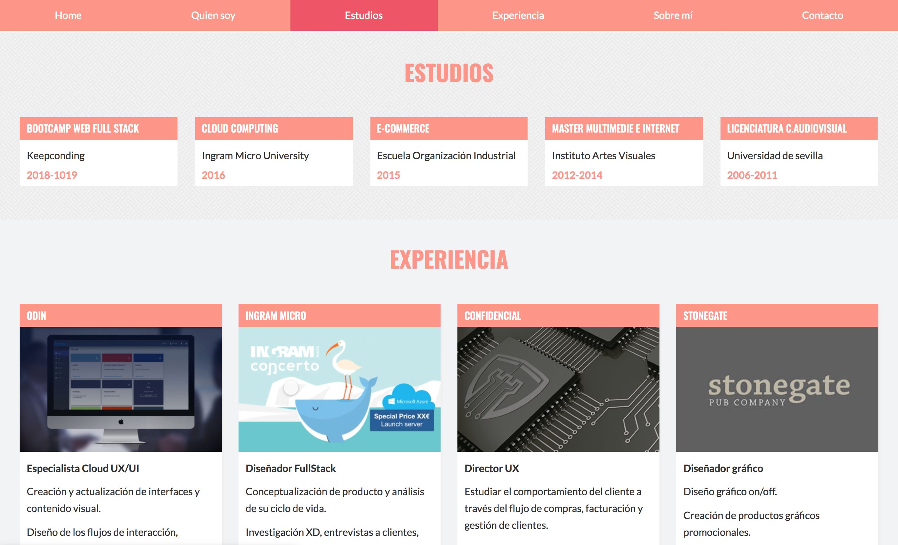

# SEO

### Optimización SEO de mi web curriculúm.

## Cambios en la estructura del HTML
La web se divide en 5 secciones, dentro de estas secciones he sustituido las etiquetas `article` por listas no ordenadas `ul`. Esta sustitución se debe a que no contenían información suficiente para considerarse artículos. 

He sustituido el menu por otro nuevo, ya que el anterior estaba formado por dos etiquetas `nav` y eliminado el javascript que le proporcionaba su caracter responsive. El nuevo menu esta dentro de una única etiqueta `nav`, y es responsive mediante el uso exclusivo de CSS.

## Utilización de Microdatos
He utilizado un item del tipo `Person` para englobar toda la información que me hace referencia, y
he definido diferentes `itemprop` como `name`, `jobTitle`...

Para la parte de formación he usado el tipo `Course`, y `itemprops` como `name`, `description` y `provider`.

Para las diferentes empresas donde he trabajado, he utilizado el tipo `Organization`, con `itemprop` como `name` o `description`.

He utilizado también microdatos para las imágenes, `ImageObject`.

Y para el footer he utilizado `CreativeWork`, con el `itemprop` `copyrightHolder`.

## Metadatos y OpenGraph
En la cabecera del documento se han incluido metadatos que indican al browser una descripción y el autor de la página, además de OpenGraph para mejorar el SEO en las redes sociales.

## Versión antigua
https://github.com/irenecav/html-javascript

